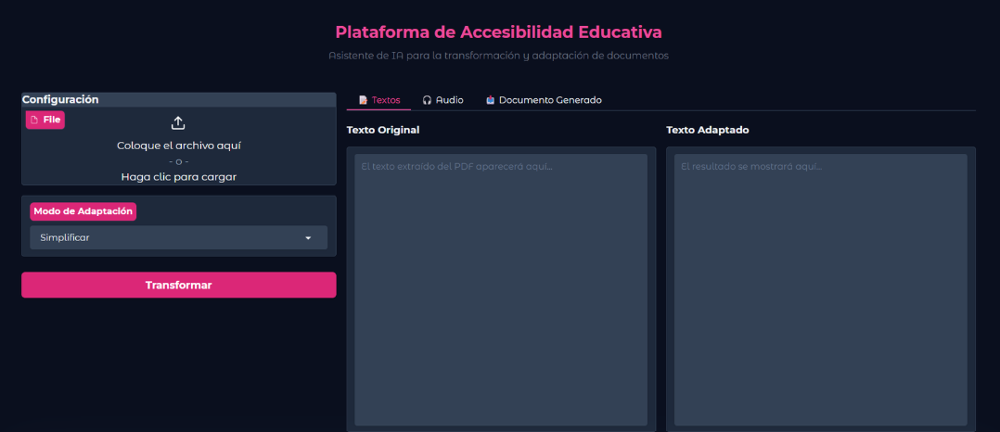

# PAEdu - Plataforma de Accesibilidad Educativa

PAEdu es una plataforma web desarrollada como Trabajo de Fin de Grado que utiliza modelos de lenguaje de gran tamaño (LLM) para adaptar materiales educativos a las necesidades del alumnado con Necesidades Específicas de Apoyo Educativo (NEAE) y Trastorno del Espectro Autista (TEA).

La aplicación permite simplificar textos, adaptar exámenes, generar versiones en lectura fácil, crear glosarios de términos complejos y producir audio a partir del contenido adaptado mediante una interfaz desarrollada con **Gradio**.

## Interfaz de la aplicación

  

## Funcionalidades

- Extracción de texto desde archivos PDF.
- Simplificación automática de textos.
- Adaptación de preguntas y exámenes.
- Generación de versiones en lectura fácil.
- Creación automática de un glosario de palabras complejas.
- Generación de audio mediante síntesis de voz.
- Exportación del resultado en formato PDF.

## Tecnologías utilizadas

- Python
- Gradio
- Hugging Face Transformers
- FLAN-T5
- PyTorch
- PyMuPDF
- spaCy
- wordfreq
- Kokoro TTS
- ReportLab
